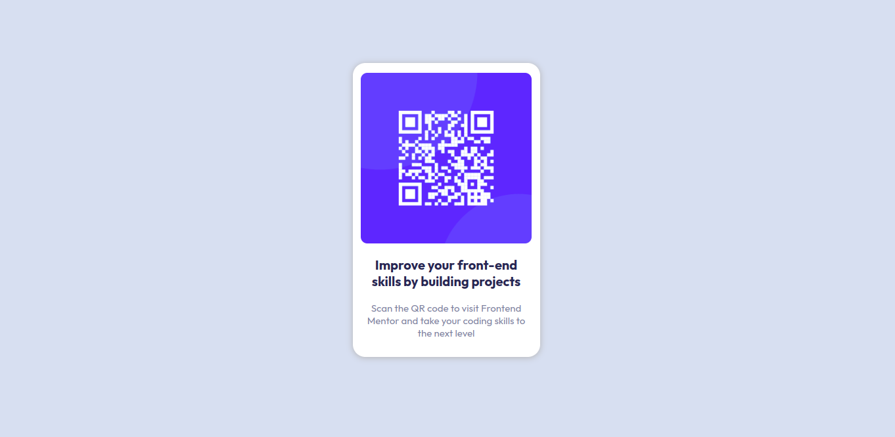

# Frontend Mentor - QR code component solution

This is a solution to the [QR code component challenge on Frontend Mentor](https://www.frontendmentor.io/challenges/qr-code-component-iux_sIO_H). Frontend Mentor challenges help you improve your coding skills by building realistic projects. 

## Table of contents

- [Overview](#overview)
  - [Screenshot](#screenshot)
  - [Links](#links)
- [My process](#my-process)
  - [Built with](#built-with)
  - [What I practiced](#what-i-practiced)
  - [Continued development](#continued-development)
  - [Useful resources](#useful-resources)
- [Author](#author)

## Overview

### Screenshot



### Links

- Live Site URL: [Deploy](https://qr-code-yamolatix.netlify.app/)
- Code Site: [GitHub](https://github.com/yamolatix/qr-code-component-challengue/)

## My process

### Built with

- Semantic HTML5 markup
- CSS custom properties
- Flexbox
- Mobile-first workflow

### What I practiced

I practiced correct flexbox theory and practice.

```html
  <main>
    <section class="card">
     ...
    </section>
  </main>
```
```css
main {
    display: flex;
    justify-content: center;
    ...
}

.card {
    display: flex;
    align-items: center;
    flex-direction: column;
    ...
}
```

### Continued development

I'll continue working on the proper functioning of the footer.

### Useful resources

- [A guide to Flexbox | css-tricks.com](https://css-tricks.com/snippets/css/a-guide-to-flexbox/) - This is an amazing article which helped me understand flexbox. I'd recommend it to anyone still learning this concept.
- [PerfectPixel | Extension para el navegador](https://chrome.google.com/webstore/detail/perfectpixel-by-welldonec/dkaagdgjmgdmbnecmcefdhjekcoceebi?hl=es-419) - This helped me order the correct dimensions. I really liked this extension and will use it in the future.

## Author

- GitHub - [/yamolatix](https://github.com/yamolatix)
- Linkedin - [/in/yamilaortiztoscano](https://www.linkedin.com/in/yamilaortiztoscano/)
- Website - [yamilaortiztoscano.com.ar](https://yamilaortiztoscano.com.ar/)
- Frontend Mentor - [@yamolatix](https://www.frontendmentor.io/profile/yamolatix)